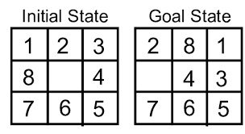

# 8_Puzzle_Game

Using Artificial Intelligence to solve the 8 Puzzle Problem.
 
**Note**
* This code till now only contains the state space tree representation for achieving the final(goal) state from an initial state. 
* It doesnt find the solution in the optimal pattern, it just generates the state space to get the solution using Blind Search with Depth First Search Pattern.

# Platform

* HTML
* JavaScript

# Library

* [p5.js](https://p5js.org/) -  A JavaScript Library

# Description

## The Problem
The 8-puzzle is a smaller version of the slightly better known 15-puzzle. The puzzle consists of an area divided into a grid, 3 by 3 for the 8-puzzle, 4 by 4 for the 15-puzzle. On each grid square is a tile, expect for one square which remains empty. Thus, there are eight tiles in the 8-puzzle and 15 tiles in the 15-puzzle. A tile that is next to the empty grid square can be moved into the empty space, leaving its previous position empty in turn. Tiles are numbered, 1 thru 8 for the 8-puzzle, so that each tile can be uniquely identified.
 
The aim of the puzzle is to achieve a given configuration of tiles from a given (different) configuration by sliding the individual tiles around the grid as described above.
 

[Source](http://www.aiai.ed.ac.uk/~gwickler/eightpuzzle-inf.html)
## Finding the Solution
The Game consists of two states - 'Initial State' and 'Goal State'. The objective is to move the one tile at a time by the blank tile and to achieve the stated goal state in possible number of steps.
